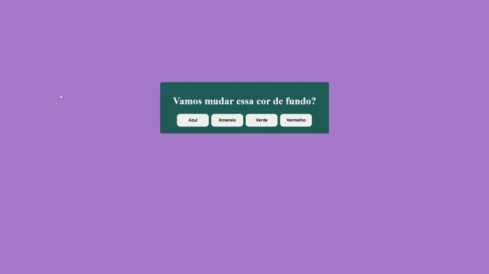
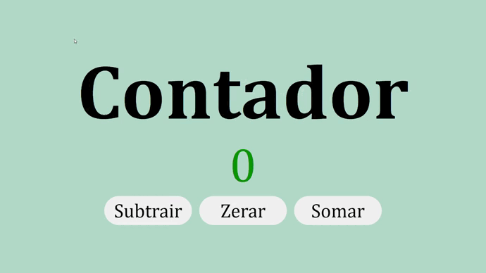

# Projetos em JavaScript

Aqui estão reunidos alguns projetinos que fiz para treinar JavaScript.

 

 

## Projeto 1 - Trocador de cores
 

Ao clicar nos botões disponíveis na página a cor de fundo é alterada de acordo com o botão escolhido. Neste primeiro projeto já se inicia a manipulação do [DOM](http://devfuria.com.br/javascript/dom/).

🖱️ Interações com a página
- Botão "Azul" - Muda a cor para azul
- Botão "Amarelo" - Muda a cor para amarelo
- Botão "Verde" - Muda a cor para verde
- Botão "Vermelho" - Muda a cor para vermelho

⌨️ Alguns elementos usados
- document.querySelector()
- addEventListener()
- document.body.style.backgroundColor

[repositório](https://github.com/Kellycns/Projetinhos-em-js/tree/main/trocador-de-cores)

## Projeto 2 - Contador
 

Um contador que funciona a partir da interação do usuário. Inicia a contagem a partir do zero e exibe a cor vermela para os números ímpares, e a cor verde para os números pares.

🖱️ Interações com a página
- Botão "Subtrair" - Subtrai 1 do valor do contador
- Botão "Zerar" - Volta o valor do contador
- Botão "Somar" - Soma 1 ao valor do contador

⌨️ Alguns elementos usados
- document.querySelector()
- .style.color
- .innerHTML
- addEventListener()

[repositório](https://github.com/Kellycns/Projetinhos-em-js/tree/main/contador)
